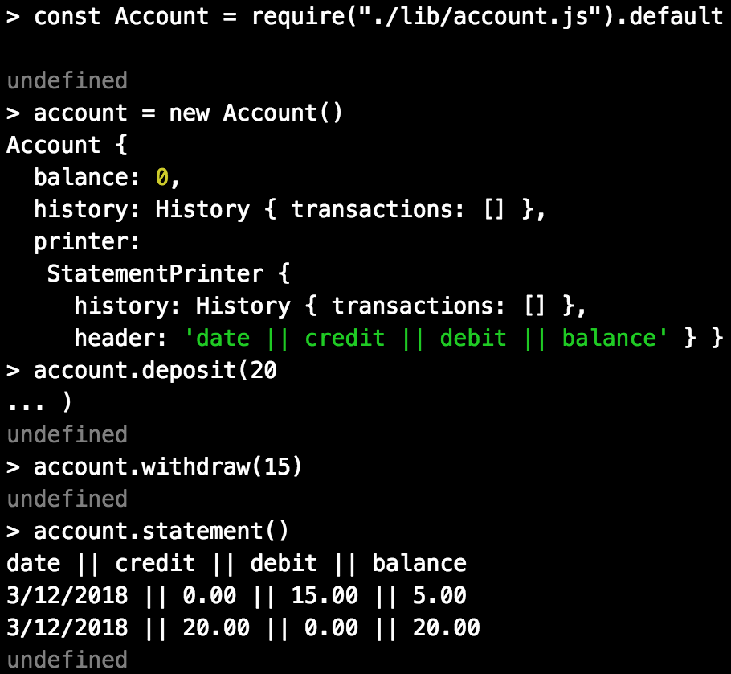

# Bank

## Description

* A tech test for week 10 of Makers Academy, written in Javascript (ES6) and test-driven with Jest.
* The user can deposit, withdraw and print a statement, which will show their transactions in chronological order.
* The user cannot withdraw more funds than they have.

## How to Use

* Clone this repo.
* Install dependencies with `npm install`

### Testing
* Run `jest --coverage` to run tests and see coverage.

### Interacting with the program
* Run `npm run build` to build the project (this is needed to use ES6 modules in node)
* Open the `node` REPL in the console and type the following:

`> const Account = require('./lib/account.js').default`

* To create an account:

`> const account = new Account()`

* To make a deposit:

`> account.deposit(5)`

* To make a withdrawal:

`> account.withdraw(3)`

* To view your statement:

`> account.statement()`

## My Approach

* I have aimed for a separation of concerns in my classes, keeping each to a single responsibility. Transactions store information about a transaction, histories store transactions, transaction views render the display for one transaction, statement printers print a table of transactions, and the account is the interface for the user.
* I test-drove the implementation of each feature.
